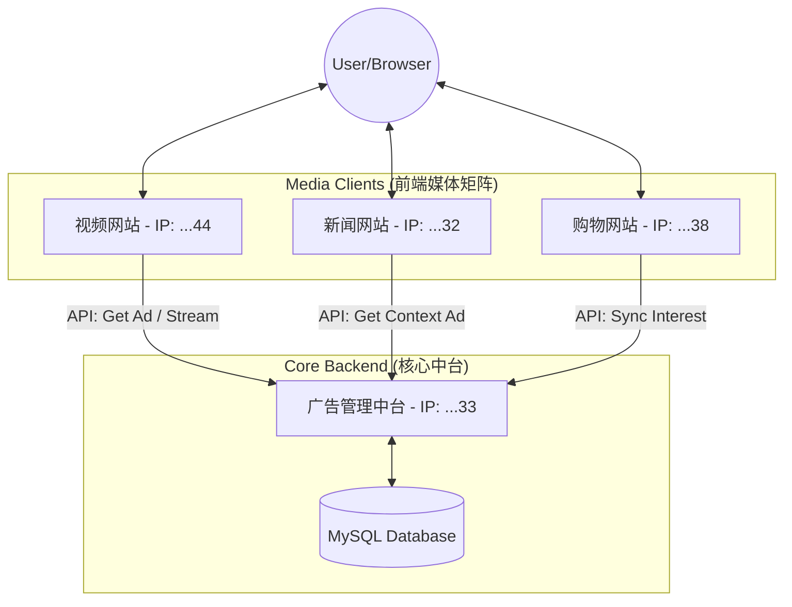

```markdown
# 互联网广告投放生态平台 (Internet Advertising Ecological Platform)

> 基于 Jakarta EE 的全链路广告投放生态系统，涵盖广告中台(Ad Server)、视频流媒体(Video)、新闻资讯(News)与在线电商(Shopping)四大独立子系统。

   

## 📖 项目简介

本项目旨在构建一个模拟真实互联网商业环境的广告投放生态系统。打破了单一 Web 应用的限制，采用**分布式微服务架构思想**，由一个核心的**广告管理中台**与三个独立的**媒体端（视频、新闻、购物）**共同组成。

系统核心实现了**跨站点的用户身份识别 (Cross-Site Identity)**、**用户兴趣画像追踪 (User Profiling)** 以及基于**上下文的精准广告投放 (Contextual Advertising)**。

### 🌐 核心组成
* **Ad Server (广告中台)**: 全网控制塔，负责素材管理、推荐算法计算及跨域身份分发。
* **Video Site (视频网站)**: 支持 HTTP 206 断点续传的流媒体平台，实现了无缝视频中插广告。
* **News Site (新闻网站)**: 基于内容上下文（如体育、娱乐）的精准广告匹配平台。
* **Shopping Site (购物网站)**: 捕捉用户购买意图（兴趣探针），构建高权重用户画像。

---

## 🏗 系统架构

系统采用 **B/S 架构** 与 **星型拓扑结构**。四个子系统逻辑上完全独立，模拟分布式部署，通过 RESTful API 进行通信。



---

## 🚀 核心技术亮点

1. 匿名用户全网跨域追踪 (Cross-Domain Tracking) 

解决分布式环境下的身份割裂问题，实现“一次访问，全网识别”。

* **Cookie 穿透**: 利用 `SameSite=None; [cite_start]Secure` 策略，实现第三方 Cookie 在不同域名间的共享 。


* **多重保障机制**:
* **Level 1**: Cookie 自动携带 `visitor_id`。
* 
**Level 2**: URL 参数透传（Fallback），若 Cookie 被拦截，通过 URL 参数 `?visitorId=...` 强制同步身份 。


* **Level 3**: 本地 UUID 生成与服务端双向验证。


2. 视频流媒体与无缝中插广告 (Video Streaming & Mid-roll Ads) 

* 
**HTTP 206 断点续传**: 后端自主研发 `MediaStreamServlet`，解析 HTTP `Range` 请求头，支持 4K 视频秒开、随意拖拽进度条 。


* 
**智能中插引擎**: 前端状态机实时监听播放进度，在预设关键帧（如第 15 秒）自动截断主视频流，无缝切换至广告流（MP4），播放结束后自动恢复断点 。


3. 三层漏斗精准推荐算法 (3-Layer Recommendation) 

位于 `AdContentService` 的智能推荐引擎：

* 
**策略 A (画像优先)**: 优先读取用户在购物网积累的高权重兴趣（如频繁浏览“数码产品”），跨站推送相关广告 。


* 
**策略 B (上下文感知)**: 若无历史画像，根据当前页面内容（如“体育新闻”）实时匹配同类广告 。


* 
**策略 C (全局兜底)**: 冷启动阶段，推送全网高转化率的默认广告 。


---

## 🛠 技术栈

### 后端 (Back-end)

* 
**Core**: Jakarta EE, Servlet 6.0 


* 
**Database**: MySQL 8.0, JDBC (DAO模式) 


* 
**JSON Processing**: Gson 


* **Protocols**: HTTP/1.1 (Range Request, CORS), REST API

### 前端 (Front-end)

* **Basic**: HTML5, CSS3, Vanilla JavaScript (ES6+)
* 
**Media**: HTML5 Video API (Events: timeupdate, ended, pause) 


* 
**Network**: Fetch API (CORS mode) 


* **Legacy**: JSP (用于服务端渲染视图)

---

## 📂 项目结构概览

项目包含四个独立的 Maven 模块/Web应用：

```text
web-ad/
[cite_start]├── adproj (广告管理中台) [cite: 177]
│   ├── src/main/java/com/example/adproj/
│   │   ├── servlet/ (AdApiServlet, AdManageServlet...)
│   │   ├── service/ (推荐算法核心)
│   │   └── dao/
│   └── webapp/ (后台管理Dashboard)
│
[cite_start]├── web-ad-xie_video (视频网站) [cite: 310]
│   ├── src/main/java/com/video/
│   │   ├── servlet/ (MediaStreamServlet - 流媒体核心)
│   │   ├── util/ (GlobalVisitorFilter - 身份追踪)
│   └── webapp/ (视频播放器前端逻辑)
│
[cite_start]├── news2121 (新闻网站) [cite: 414]
│   └── 上下文广告匹配逻辑与新闻CMS
│
[cite_start]└── shopping-web (购物网站) [cite: 540]
    └── 用户兴趣采集探针与电商逻辑

```

---

## 📸 功能演示

### 1. 视频中插广告与流媒体控制

> 视频播放至 15 秒自动暂停，无缝切换广告流，广告结束后恢复播放。支持进度条拖拽。
> *(此处可链接演示 GIF)*

### 2. 跨域画像同步

> 用户在**购物网**浏览“数码相机”，随后访问**新闻网**，侧边栏广告自动变为“摄影器材”。
> *(此处可链接演示截图)*

### 3. 广告管理后台

> 广告主上传素材（图片/视频），配置投放策略与分类标签。
> *(此处可链接 Dashboard 截图)*

---

## 👥 团队分工

| 成员 | 角色 | 负责模块 | 核心贡献 |
| --- | --- | --- | --- |
| <br>**谢云泽** 

 | **组长** | **视频网站 + 跨域架构** | 视频网站设计、HTTP 206 流媒体引擎、跨域身份追踪实现 (Cookie/URL)、视频资料搜集 

 |
| 字文韬 | 组员 | 广告中台 | 广告 API 接口设计、推荐算法逻辑、广告管理后台开发 

 |
| 张文文 | 组员 | 购物网站 | 电商功能实现、用户兴趣采集探针、广告图文资料搜集 

 |
| 叶君韬 | 组员 | 新闻网站 | 新闻 CMS 实现、基于上下文的广告展示逻辑 

 |

---

## 🏁 快速开始 (Deployment)

1. **数据库准备**:
* 导入 SQL 脚本至 MySQL，创建 `ad_system` 库。
* 配置各子系统的 `db.properties` 文件。


2. **环境配置**:
* 需要模拟 4 个不同 IP 或端口（例如 localhost:8080, localhost:8081...）以测试跨域功能。
* 修改各子系统中的 API 请求地址，指向 Ad Server 的实际地址。


3. **启动**:
* 部署 4 个 WAR 包至 Tomcat 10+。
* 首先访问 **Ad Server** 初始化数据。
* 访问 Video/News/Shopping 站点体验广告流转。


---

*Project developed for University of Shanghai for Science and Technology, Web Application Development Course (2025).* 

```

```
